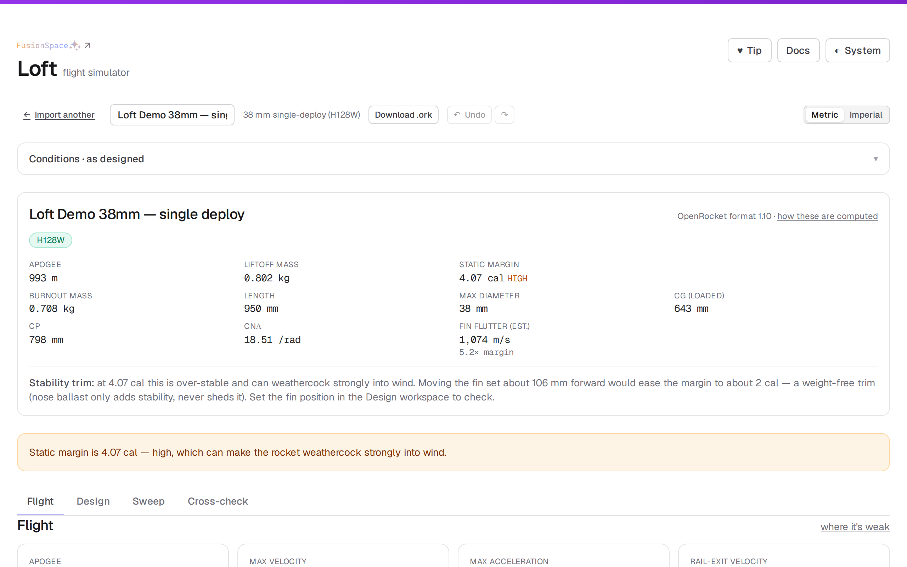
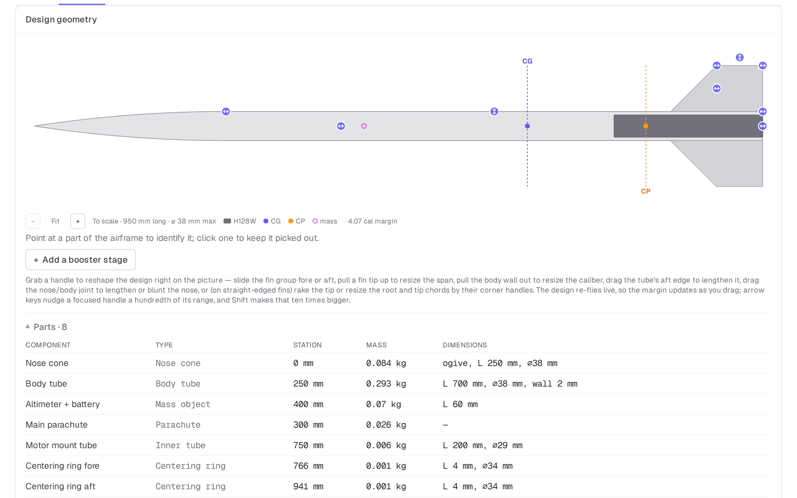
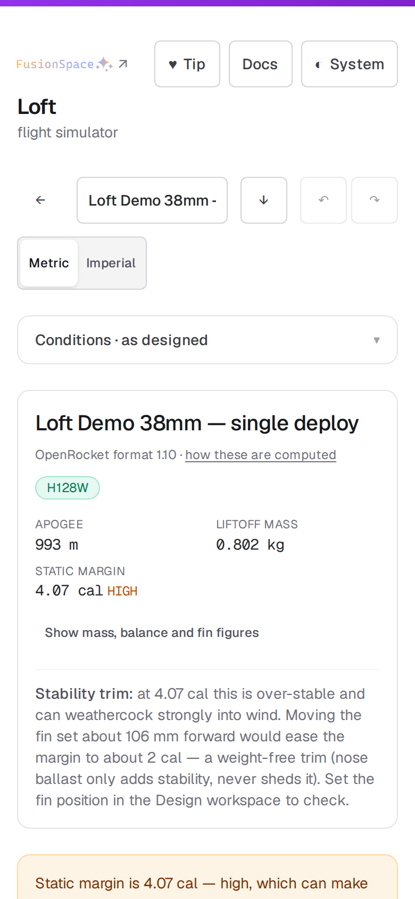
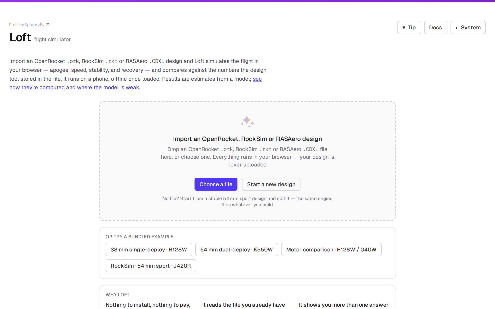

# Loft

[](https://github.com/nrdptel/fusionspace-loft/actions/workflows/test.yml)
[](LICENSE)

A flight simulator for high-power rocketry that runs in your browser and works on a phone,
at [loft.fusionspace.co](https://loft.fusionspace.co).

Import an OpenRocket `.ork`, RockSim `.rkt` or RASAero `.CDX1` design — or build one from
scratch — and Loft simulates the flight: apogee, velocity and Mach, stability margin, rail-exit
speed, and recovery descent and drift. Then it compares its numbers against the results your
file already carries, and against a second solver running in the same browser tab, so you get
several independent answers rather than one to trust on faith. It runs entirely in your
browser: your design is never uploaded, and once loaded it works with no signal, so it's
usable at the pad.

**Every figure is an estimate from a model, not a measurement, and never a go/no-go verdict.**
Verify independently. The motor's printed data and your RSO are authoritative; the flyer is
responsible for the flight. Where the model is weak is written down, in the open, in the
[limitations log](https://loft.fusionspace.co/docs/limitations).

Part of [Fusion Space](https://fusionspace.co) — free, polished tools for high-power rocketry.
See also the [HPR Motor Finder](https://motor.fusionspace.co),
[Charge](https://charge.fusionspace.co), and [Window](https://window.fusionspace.co).

## What it looks like

Every picture below is taken from the built export by `scripts/gen-screenshots.mjs`, which loads a
real bundled design and waits for the numbers to be on screen before capturing — so they cannot
quietly drift out of date, and regenerating them is one command rather than an afternoon.

**A design, flown.** Apogee, mass, stability margin, fin flutter and the rest, with the cautions the
numbers earn — here a 4.07-cal margin that will weathercock, and the weight-free trim that would fix
it.



**The builder.** A to-scale airframe you reshape by dragging it — fin group fore and aft, fin span,
body caliber, tube length, nose bluntness — with CG and CP marked and the design re-flying live as
you drag. The parts table underneath is the component tree exactly as Loft parsed it.



**At the pad.** The same flight, one-handed, at 390 px, with no signal.



**And the first screen, with no file** — four bundled examples and a from-scratch builder, so the
tool is usable before you have anything to import.



## What it does

- **Imports OpenRocket `.ork`, RockSim `.rkt` and RASAero `.CDX1` designs** (`.ork` also
  gzip-wrapped or as raw XML), reading the component tree, materials, motor mounts, recovery, and
  the stored simulation results — and degrading gracefully, with a clear note, on anything it
  doesn't recognise.
- **Builds and edits a design in the browser.** Start from scratch or open a file, then add,
  remove and reorder components, pick real catalogue parts by vendor and part number, author a
  booster stage or a motor mount, and re-fly on every change. Undo covers all of it.
- **Simulates the flight** with a format-agnostic core: a canonical internal rocket model, a
  standard-atmosphere model, Barrowman stability, a component-buildup drag model, real motor
  thrust curves, and a 4th-order Runge–Kutta integrator with 6-DOF-shaped state.
- **Resolves motors to real thrust curves.** A `.ork` names a motor but doesn't embed its
  curve, so Loft resolves it against a bundled, offline database of RASP `.eng` curves from
  ThrustCurve.org — and tells you when a match is approximate or missing rather than guessing.
- **Shows the flight**: apogee, max velocity/Mach/acceleration, rail-exit and burnout velocity,
  descent rate and drift, dynamic pressure, and timings — plus altitude/velocity/acceleration
  and thrust-curve plots and a phase-coloured flight-path picture. Metric or imperial.
- **Compares against the tool your file came from** — Loft flies your design under its own stored
  launch conditions and diffs each metric against the numbers OpenRocket, RockSim or RASAero
  stored, so the accuracy is measured and shown, not assumed.
- **Runs a second solver on the same design.** RocketPy executes in your browser under Pyodide
  and its answer is shown beside Loft's, because agreement between independent engines is worth
  more than either number alone — and disagreement is worth knowing about.
- **Sweeps and Monte-Carlo**: sweep a parameter or a motor selection across candidates, and run a
  dispersion of several hundred flights to size a recovery area rather than guess at one.
- **Re-flies for today's weather** (optional): pulls live surface conditions and winds aloft
  for a launch site from Open-Meteo to see how today's density and wind change apogee and drift.
- **Warns on extrapolation** — marginal stability, low rail-exit velocity, transonic/supersonic
  flight outside the drag model's validated envelope — without ever issuing a verdict.
- **In-site docs** with every calculation linked to its published source, a candid limitations
  log, and a validation section — the math is meant to be checked, not trusted.
- **Private by default**: everything runs client-side, no accounts, no ads, no tracking.
- Installable, and works **offline** once loaded — launches happen where there's no signal.

## How it works

The simulation core is deliberately separated from the importer: the solver only ever sees a
canonical `Rocket`, never a `.ork`. Importers are thin adapters into that one model — which is
why RockSim and RASAero support arrived as adapters rather than rewrites, and why the in-app
builder produces the same model the importers do. The physics
lives in `lib/sim/` as pure functions with tests alongside; the full method, with sources, is
in the app under **Docs → Methods**, and its known weaknesses under **Docs → Limitations**.

## Running locally

Static site built with Next.js and Tailwind, exported to plain HTML/CSS/JS. Everything runs in
the browser; there is no backend.

```
npm install
npm run dev      # local dev server
npm run build    # static export to ./out
npm test         # unit tests (parser + sim core)
npm run lint     # lint
npm run test:e2e # Playwright browser tests (run after a build)
```

## Deploying

Hosted on Cloudflare Pages as a fully static site. Build command `npm run build`, output
directory `out`. No Functions, no server-side code.

## Disclaimer

Personal, non-commercial project — not affiliated with any rocketry vendor or manufacturer,
nor with OpenRocket. Built for the hobby rocketry community.

## License

Released under the [MIT License](LICENSE) — fork it, modify it, deploy your own copy, no
attribution required.
